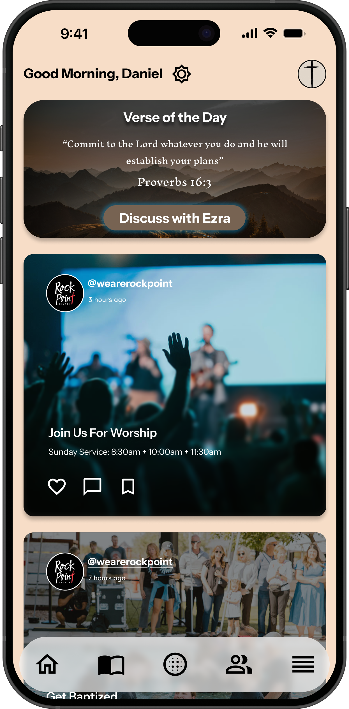
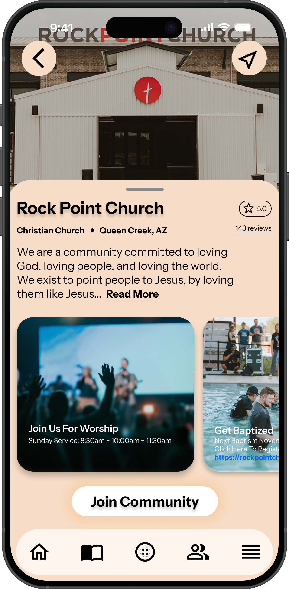

## _At Ezra, we’re focused on creating a platform centered around the individual, their faith journey, their community, and their connection to God._

Every piece of content, from devotionals to church updates, is designed to meet users where they are, guiding them toward meaningful engagement and growth in their spiritual life.
In today’s fast-paced digital world, staying connected to faith and community can be challenging. Ezra is changing that by redefining how believers engage with their churches, scripture, and one another, all through a single, beautifully designed platform.

Our **Home Page** provides a tailored spiritual experience each day. From a personalized greeting and daily verse to church updates and inspirational posts, Ezra keeps users grounded in faith while staying connected to their church family. The “Discuss with Ezra” button encourages meaningful reflection and conversation around scripture, creating a space where technology deepens, rather than replaces, spiritual connection. We are currently in the progress of developing our state of the art Large Language Model (LLM) which will help enhance the experience for the individual. **_STAY TUNED!_**

With its intuitive and modern interface, Ezra connects users directly to local churches and communities. The **_Community Map_** feature helps users discover nearby churches, like Rock Point Church in Queen Creek, AZ, with detailed profiles, reviews, service times, and opportunities to get involved. Whether it’s joining a Sunday worship service, registering for a baptism, or connecting with like-minded believers, Ezra makes community engagement simple and personal.

Ezra’s mission is simple yet profound: **bring users under one platform**. By seamlessly blending innovation with inspiration, Ezra empowers churches and individuals alike to grow together, support one another, and bring community to life through the power of technology.

## Our Designs!

*Ezra's startup page*

*A home page with personalized content for your faith*

*View a community's page on Ezra!*